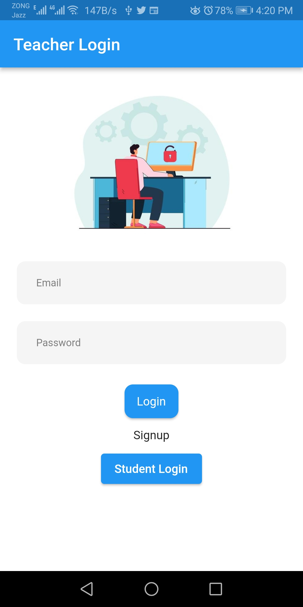
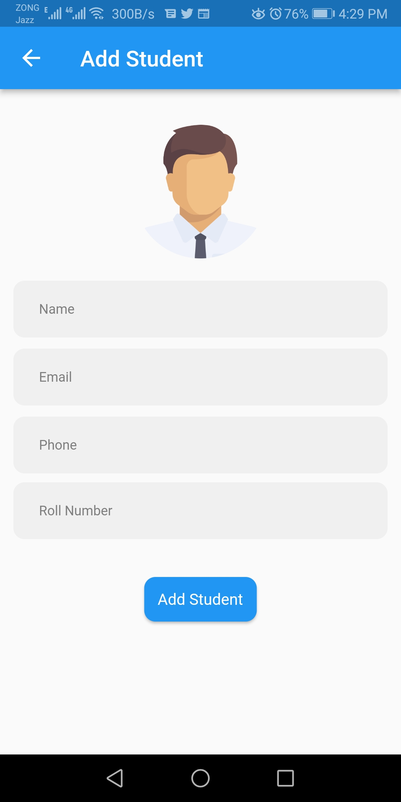
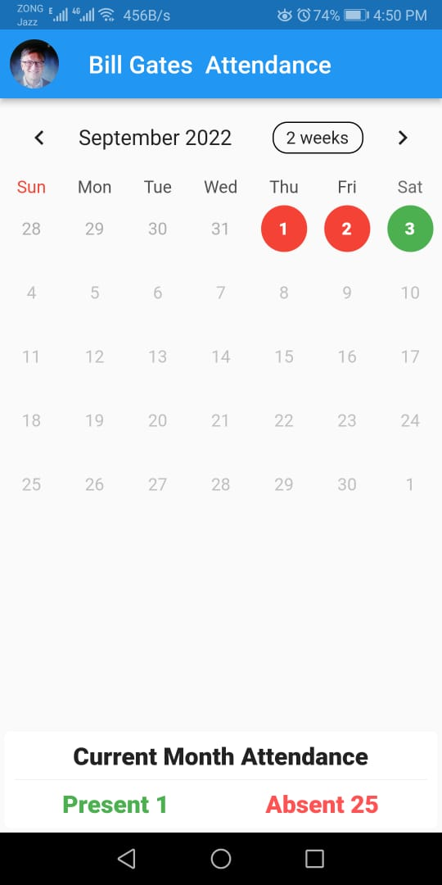

## FACE Attendance App Flutter

 

&nbsp;
&nbsp;  

&nbsp;

  
 

## ⭐ Future Features

  - Create Multiple Classes
  - Add Multiple Students in Multiple Classes
  - Mark Attendance max 10 Studens at a time with one image
  - Track Daily Attendance
  - Track Monthly Attendance

*Feel free to fork and contribute to include these features.* ❤︎

## 🚀 Technologies

  - [Flutter v1.17.4] 
  - [Dart v2.8.4](https://dart.dev/get-dart)

## 🤝 Contribute

To contribute, fork the repository and push the changes to the **master** branch. Then submit a pull request for merging with the source. If your code passes the review and checks it will be merged into the master branch.
 
